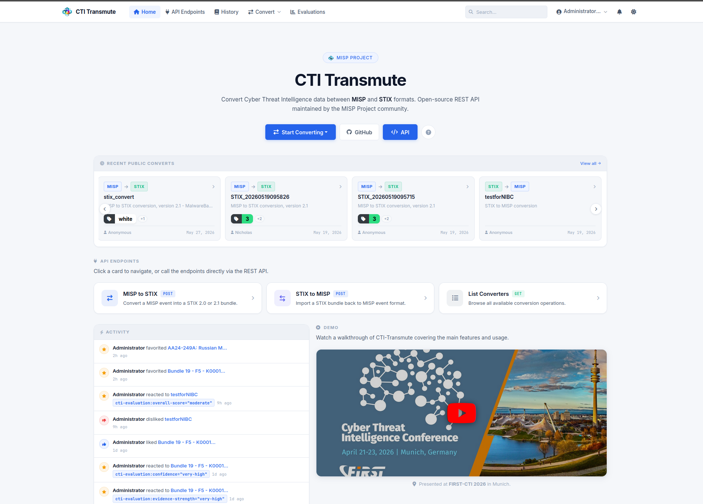
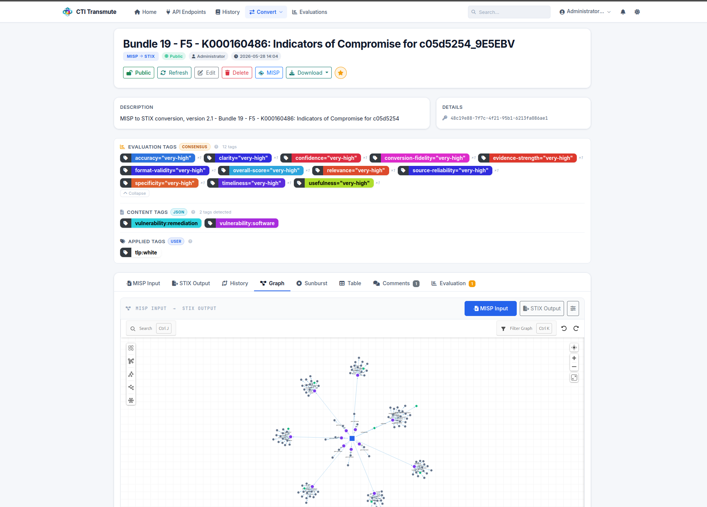
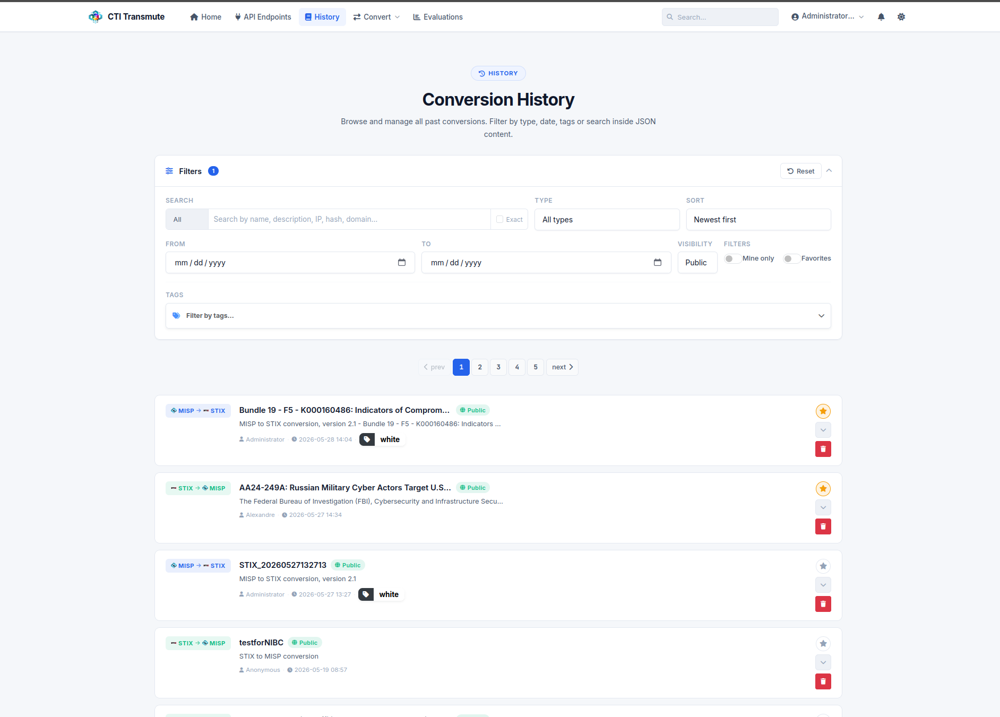

# CTI-Transmute


An **online service for converting cyber threat intelligence format** ([CTI-Transmute.org](https://cti-transmute.org/)), built to **promote interoperability and seamless data exchange**. This repository includes the complete source code of the online service if you want to run it locally. This service **leverages** the **misp-stix open-source library** ([misp-stix](https://github.com/misp/misp-stix)) to facilitate conversion.

## Main Features

* **API**: A quick and easy-to-use **API** for converting between the **MISP** ([MISP standard](https://misp-standard.org/)) and **STIX** formats.
* **User Management**: An **intuitive interface** to manage users of the service.
* **History**: Keeping track of all the conversions (**private and public**). API clients opt in with **`?persist=true`** (see [API authentication and persistence](#api-authentication-and-persistence)).
* **Diffing**: **Reviewing changes** of conversions and updates in the CTI file converted — available for any conversion saved via the UI or a persisting API call.
* **Share**: A **Share link** to allow users to share conversions with private groups — persisted API conversions get one too.
* **Live Conversion**: Users can directly convert **rules** in the **UI or via the API**.

## Demo

A video walkthrough of CTI-Transmute is available on YouTube. It covers the main features and usage of the service.

[](https://www.youtube.com/watch?v=-9GbyvoktXc&t=7973s)

## Screenshots

| Dashboard Overview | Component Details | Asset Management |
| :---: | :---: | :---: |
|  |  |  |


## Installation

### Prerequisites

- Python 3.10 or higher
- A recent version of `uv` — installation instructions [here](https://docs.astral.sh/uv/getting-started/installation/)
- PostgreSQL (the default credentials are `cti_user / cti_pass` on `localhost:5432/cti_db`)

### Fresh install on a new machine

```bash
# 1. Clone with submodules (misp-taxonomies, misp-galaxy, pivotick)
git clone --recurse-submodules https://github.com/MISP/cti-transmute.git
cd cti-transmute

# 2. One-shot init: install deps + create DB + run migrations
uv run manage init

# 3. Start
uv run manage start
```

> **Note:** `uv run manage init` tries to create the PostgreSQL role and database automatically (connecting as the `postgres` superuser). If that fails due to permissions, create them manually first:
> ```sql
> CREATE ROLE cti_user WITH LOGIN PASSWORD 'cti_pass';
> CREATE DATABASE cti_db OWNER cti_user;
> ```
> Then re-run `uv run manage init`.

### Managing the service

CTI-Transmute ships with a `manage` script that covers all day-to-day operations:

```bash
uv run manage init     # First-time setup (submodules + deps + DB + migrations)
uv run manage start    # Start the website
uv run manage update   # Pull latest code + sync deps + run DB migrations
uv run manage backup   # Backup the PostgreSQL database
uv run manage deploy   # Full production deployment: backup → update → start
uv run manage db       # Run flask db upgrade (or: db migrate, db downgrade…)
uv run manage help     # Show all commands
```

**Daily use** — just start the app:

```bash
uv run manage start
```

**After pulling new code** (migrations run automatically):

```bash
uv run manage update
uv run manage start
```

**Production deployment** (backup first, then update and restart):

```bash
uv run manage deploy
```

## Query Examples

The main feature provided with the API is a seamless conversion between CTI standards.

Here are some examples:

* *Get the list of currently supported converters*

```bash
curl -X GET https://cti-transmute.org/api/convert/list
```

This is the canonical source for what the service can convert: one entry per
direction, each with a `params_schema` describing the parameters that direction
accepts. Requesting a direction that is not listed there returns **404**.

* *Convert MISP data to STIX 2.1*

```bash
curl -X POST -H "Content-Type: application/json" -d "@/path/to/misp_data.json" \
https://cti-transmute.org/api/convert/misp_to_stix

# OR
curl -X POST -F "file=@/path/to/misp_data.json" https://cti-transmute.org/api/convert/misp_to_stix
```

* *Convert STIX 2.x Bundle to MISP standard format*

```bash
curl -X POST -H "Content-Type: application/json" -d "@/path/to/stix_data.json" \
https://cti-transmute.org/api/convert/stix_to_misp

# OR
curl -X POST -F "file=@/path/to/stix_data.json" https://cti-transmute.org/api/convert/stix_to_misp
```

Conversion parameters travel in the **query string** — for example, to get a
STIX 2.0 bundle instead of the default 2.1:

```bash
curl -X POST -H "Content-Type: application/json" -d "@/path/to/misp_data.json" \
"https://cti-transmute.org/api/convert/misp_to_stix?version=2.0"
```

An invalid or unknown parameter returns a **400** with `{"error": …, "fields": …}`
pinpointing the rejected field.

The calls above are **stateless**: the response body *is* the converted
document, and nothing is saved on the server. Any call with **`?persist=true`**
instead returns the envelope described in
[API authentication and persistence](#api-authentication-and-persistence) —
the converted document plus the identifiers of the saved Conversion.

## API authentication and persistence

The same conversion endpoint supports three flows, from throwaway one-liner to
a fully catalogued Conversion. All three run against `misp_to_stix` below;
everything applies to `stix_to_misp` the same way.

**1. Anonymous, stateless** — quick conversion; nothing is saved on the server:

```bash
curl -X POST -H "Content-Type: application/json" -d "@/path/to/misp_data.json" \
https://cti-transmute.org/api/convert/misp_to_stix
```

The response body is the converted document itself (here: a STIX bundle).

**2. Authenticated, stateless** — same call with your API key; still nothing saved:

```bash
curl -X POST -H "X-API-KEY: <your-api-key>" \
-H "Content-Type: application/json" -d "@/path/to/misp_data.json" \
https://cti-transmute.org/api/convert/misp_to_stix
```

The key identifies you to the service, so scripts can use one call shape for
stateless and persisting requests alike. A wrong key is rejected with a **403**
(`{"message": "Invalid API key"}`) rather than silently treated as anonymous,
so key-rotation mistakes surface immediately.

> **Where to find your API key:** log in and open your account page
> (`/account`) — the key is displayed in your profile.

**3. Authenticated, persisting** — add `?persist=true` to save the result as a
Conversion, exactly as if you had converted through the UI:

```bash
curl -X POST -H "X-API-KEY: <your-api-key>" \
-H "Content-Type: application/json" -d "@/path/to/misp_data.json" \
"https://cti-transmute.org/api/convert/misp_to_stix?persist=true"
```

Instead of the bare document, the response is an envelope — the converted
payload plus the saved Conversion's identifiers:

```json
{
  "conversion": {
    "type": "bundle",
    "id": "bundle--a6ef17d6-91cf-4b34-9b3e-1c2d3e4f5a6b",
    "objects": [ "..." ]
  },
  "id": 42,
  "uuid": "5bf21cfe-487e-431d-9514-773a9365cde1",
  "url": "/conversions/42"
}
```

The saved Conversion is owned by your account and gets the full catalogue
treatment: it appears in your History, can be refreshed and diffed, shared via
a Share link, and commented on. Fetch it back later:

```bash
# The Conversion's page in the catalogue (the envelope's "url"):
curl -L https://cti-transmute.org/conversions/42

# The converted output as JSON:
curl https://cti-transmute.org/conversions/download/42/output
```

Persisting also works **without** an API key — the Conversion is then saved
anonymously (owned by nobody), matching what the web UI does for logged-out
visitors.

## Funding 

ENSOC (101127660 — ENSOC — DIGITAL-ECCC-2022-CYBER-03) is a European project co-financed under the call DIGITAL-ECCC-2022-CYBER-03, aiming to create a Crossborder Platform with the purpose of improving the collective security of EU stakeholders and support CSIRTs and SOCs by overlapping defensive capabilities.

The ENSOC Consortium composed of seven member states, namely Austria, Luxembourg, Romania, Netherlands, Portugal, Italy and Spain have joined together to build a collaborative, interoperable and sustainable crossborder SOC platform with the aim to support the detection and prevention of cyber threats.

Co-Funded by the European Union. Views and opinions expressed are however those of the author(s) only and do not necessarily reflect those of the European Union or ECCC. Neither the European Union nor the granting authority can be held responsible for them.


## License

CTI-Transmute is free software released under the "GNU Affero General Public License v3.0".

~~~
Copyright (c) 2025 Computer Incident Response Center Luxembourg (CIRCL)
Copyright (c) 2025 Christian Studer - https://github.com/chrisr3d
Copyright (c) 2025 Theo Geffe - https://github.com/ecrou-exact/ 
~~~
